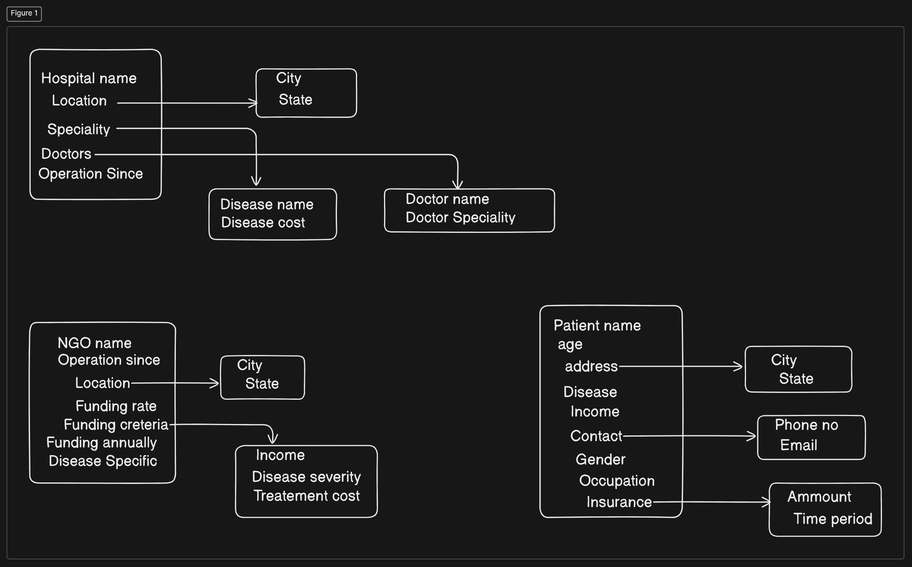

# React + Vite

This template provides a minimal setup to get React working in Vite with HMR and some ESLint rules.

Currently, two official plugins are available:

- [@vitejs/plugin-react](https://github.com/vitejs/vite-plugin-react/blob/main/packages/plugin-react/README.md) uses [Babel](https://babeljs.io/) for Fast Refresh
- [@vitejs/plugin-react-swc](https://github.com/vitejs/vite-plugin-react-swc) uses [SWC](https://swc.rs/) for Fast Refresh

Components:

1. User Authentication and Authorization:
Allow users to register/login as patients, healthcare providers, NGOs, and funding organizations.
Implement role-based access control to ensure appropriate data access.

2. Patient Profile:
Basic information (name, DOB, contact details).
Medical history, including diagnoses, treatments, surgeries, allergies, medications, and immunizations.
Insurance information.
Family medical history.
Consents for data sharing.

3. NGO and Funding Organization Integration:
Database of NGOs and funding organizations.
Application process for financial assistance.
Integration with patient profiles for eligibility checks.

4. Hospitals list

5. AI Model Integration:
Health condition analysis.
Graphical representation of health data.
Future health predictions.
Integration with patient profiles for personalized insights.

6. Communication and Notifications:
Secure messaging between patients and healthcare providers.
Automated reminders for appointments, medication refills, etc.

npm i axios - for api's
- we have to use proxy also, in vite.config, we have to make changes.

